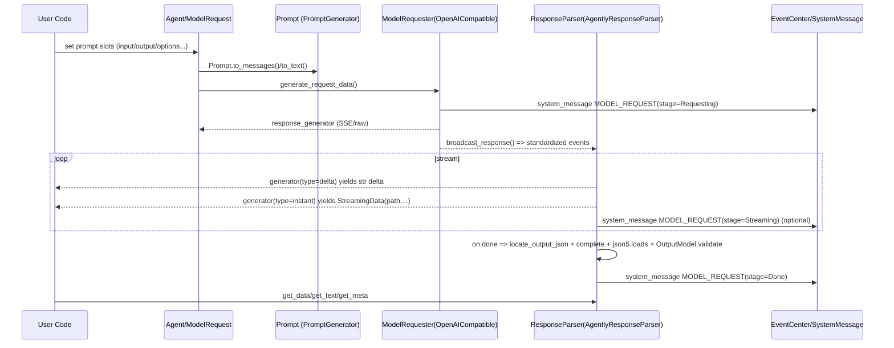

# 00 / 架构（Architecture）

## 1. 初始化序列（全局单例的构建）

`agently/__init__.py` 创建 `Agently = AgentlyMain()`。其构建过程由 `agently/base.py` 完成：

1. 创建全局 `Settings(name="global_settings")` 并加载 `agently/_default_settings.yaml`
2. 创建全局 `PluginManager(settings, name="global_plugin_manager")` 并注册默认插件：
   - `PromptGenerator` → `AgentlyPromptGenerator`
   - `ModelRequester` → `OpenAICompatible`（并 activate）
   - `ResponseParser` → `AgentlyResponseParser`
   - `ToolManager` → `AgentlyToolManager`
3. 创建 `EventCenter` 并注册 hooker：
   - `SystemMessageHooker`
   - `PureLoggerHooker`
4. 创建全局 `Tool(plugin_manager, settings)`（其内部实例化 ToolManager 插件）
5. 通过多继承把 `BaseAgent` + 扩展（Tool/KeyWaiter/AutoFunc/ConfigurePrompt）合成为默认 `Agent` 类型。

详细初始化细节见：`spec/01_Configuration/INITIALIZATION.md`。

## 2. 请求/响应主链路（Prompt → Request → Stream → Parse）

下面是一个“结构化输出 + 流式解析”的典型执行链路：

## 3. 插件边界（可替换点）

Agently 的“可替换点”主要是四类插件（见 `agently/types/plugins/base.py`）：

- `PromptGenerator`：把 PromptModel 转为 text/messages + 生成 output model
- `ModelRequester`：把 Prompt 转成请求数据 + 发请求 + 把供应商流转成统一事件流
- `ResponseParser`：消费统一事件流，产出 text/parsed/meta，支持 instant streaming_parse
- `ToolManager`：工具注册/查询/调用/MCP 工具导入

在复刻实现时建议严格保持这四类边界，否则会导致：
1) 扩展性降低（无法换模型/换解析/换工具系统）；  
2) 流式能力与结构化输出难以复用。

## 4. 事件系统与可观测性

- `EventCenter` 提供：
  - `register_hook(event, callback)`
  - `register_hooker_plugin(hooker)`（hooker 绑定多个 event）
  - `async_emit(event, message)`
  - `async_system_message(type, data, settings)`
- SystemMessageHooker 会将：
  - 模型请求阶段/流式 delta 输出
  - 工具调用日志
  - TriggerFlow 事件
 以更可读的形式发到 `console` 或 `log` 事件。

## 5. TriggerFlow 的架构（BluePrint + Execution）

TriggerFlow 由两部分组成：

- `TriggerFlowBluePrint`：工作流“图”的定义（handlers + chunks）
- `TriggerFlowExecution`：一次运行实例（runtime_data/system_runtime_data/queue/result_ready）

TriggerFlow 的 DSL（`.when().to().batch().for_each().match()` 等）本质上是“往 BluePrint 里添加 handler”的语法糖。

详见：`spec/05_TriggerFlow/TRIGGERFLOW_SPEC.md`。

